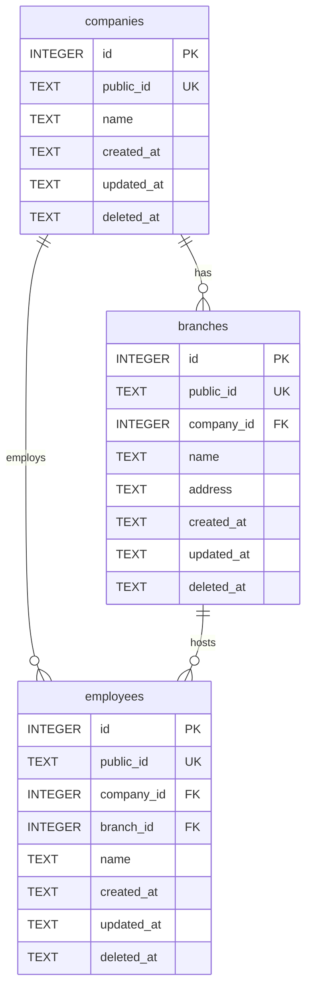

# Fake Employee Management API

REST API for managing companies, branches, and employees. Built with Express, TypeScript, and SQLite.

---

## Prerequisites

| Requirement | Version |
|-------------|---------|
| Node.js | `>= 24.11.0` |
| npm | `>= 11.6.1` |

> These constraints are enforced via the `engines` field in `package.json` and `engine-strict=true` in `.npmrc`. npm will refuse to install if the versions don't meet the requirements.

---

## Installation

```bash
npm install
```

---

## Configuration

Copy the example env file and set your values:

```bash
cp .env.example .env
```

| Variable | Required | Description |
|----------|----------|-------------|
| `DELETE_AUTH_TOKEN` | Yes | Secret token required in the `x_delete_auth` header for all DELETE requests |
| `PORT` | No | HTTP port (default: `3000`) |

---

## Running the project

```bash
# Development (hot reload)
npm run dev

# Production
npm run build
npm start
```

---

## API Documentation

Once the server is running, open **[http://localhost:3000/docs](http://localhost:3000/docs)** in your browser to access the interactive Scalar API reference.

The raw OpenAPI spec is available at **[http://localhost:3000/openapi.json](http://localhost:3000/openapi.json)**.

---

## Entity-Relationship Diagram



> All deletes are **soft deletes** — records are never removed from the database, only marked with a `deleted_at` timestamp. Deleting a company cascades the soft delete to all its branches.

---

## Endpoints

### Health
| Method | Path | Description |
|--------|------|-------------|
| `GET` | `/v1/health` | Service and database status |

### Companies
| Method | Path | Description |
|--------|------|-------------|
| `GET` | `/v1/companies` | List all companies |
| `POST` | `/v1/companies` | Create a company |
| `GET` | `/v1/companies/:id` | Get a company |
| `PUT` | `/v1/companies/:id` | Update a company |
| `DELETE` | `/v1/companies/:id` | Soft-delete a company (requires `x_delete_auth`) |

### Branches
| Method | Path | Description |
|--------|------|-------------|
| `GET` | `/v1/companies/:id/branches` | List branches of a company |
| `POST` | `/v1/companies/:id/branches` | Create a branch |
| `GET` | `/v1/companies/:id/branches/:branchId` | Get a branch |
| `PUT` | `/v1/companies/:id/branches/:branchId` | Update a branch |
| `DELETE` | `/v1/companies/:id/branches/:branchId` | Soft-delete a branch (requires `x_delete_auth`) |

### Employees
| Method | Path | Description |
|--------|------|-------------|
| `GET` | `/v1/companies/:id/employees` | List employees of a company |
| `POST` | `/v1/companies/:id/employees` | Hire an employee |
| `GET` | `/v1/companies/:id/employees/:empId` | Get an employee |
| `PUT` | `/v1/companies/:id/employees/:empId` | Update name or transfer branch |
| `DELETE` | `/v1/companies/:id/employees/:empId` | Fire an employee (requires `x_delete_auth`) |

---

## Delete Authorization

All `DELETE` endpoints require the following header:

```
x_delete_auth: <your DELETE_AUTH_TOKEN value>
```

| Response | Meaning |
|----------|---------|
| `401` | Header is missing |
| `403` | Token is incorrect |
| `204` | Soft-delete successful |

---

## Database

SQLite database file is stored at `data/employees.db`. The file is created automatically on first run. To connect:

```bash
# CLI
sqlite3 data/employees.db

# GUI — point any SQLite client to:
data/employees.db
```
